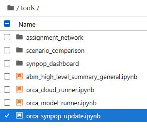
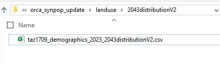
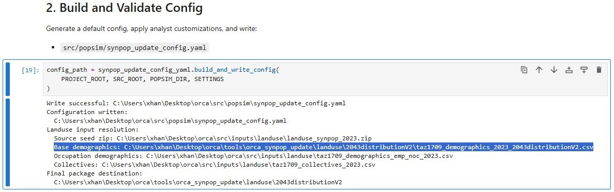
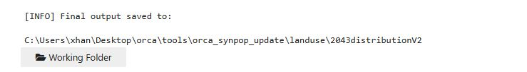
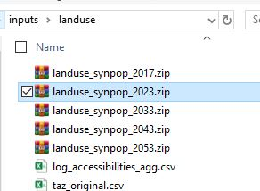

::: {.callout-note appearance="simple"}
A **helper guide** — reference material for working with the PopulationSim
component, not part of the linear Setup → Run walkthrough. Dip in as needed.
:::

## Overview

**PopulationSim** generates the synthetic population that downstream demand
models (ActivitySim) consume. It is one of the five ORCA components and runs
in its own isolated Python environment.

## Where it fits in ORCA

| Aspect | Value |
|---|---|
| Python environment | `populationsim` — Python 3.10, managed by `uv` (`.py_envs\populationsim`) |
| Scenario folder | `<scenario>/popsim/` — configs + input data |
| Config block | `sub_components.populationsim` in `<scenario>/orca_model_config.yaml` |

Because PopulationSim feeds ActivitySim, it typically runs **early** (often
only on the first iteration). Whether it executes is controlled by its
`iterations:` key in the scenario config — see [Running the Model](../chapters/02-run-model.qmd)
for the `all` / `first` / `last` / `[1,3]` semantics shared by all components.

## Running just PopulationSim

To iterate on population synthesis without running the full model, trim
`model_steps` in `<scenario>/orca_model_config.yaml` to the population step
only, then run as usual:

```bat
python -m tlpytools.orca --action run_model --scenario db_example --mode local_testing
```

::: {.callout-warning}
Edit the **scenario** config (`<scenario>/orca_model_config.yaml`), never the
template (`src/orca/orca_model_config_default.yaml`). The template only
applies the next time you `init_model` a fresh scenario.
:::

## Inputs and outputs

- **Inputs** live under `<scenario>/popsim/` (controls, seed tables, geographic
  crosswalks).
- **Outputs** land in the component's output directory and are picked up by
  ActivitySim as its base population.

## Troubleshooting

| Symptom | Likely cause | Fix |
|---|---|---|
| `ImportError` when the popsim step runs | Wrong/!built environment | Re-run `run_python_cmds.bat`; confirm `.py_envs\populationsim` built |
| Step skipped unexpectedly | `iterations:` excludes the current iteration | Check `sub_components.populationsim.iterations` in the scenario config |


## Examples
### Age Cohort Analysis

**Study Target**: Restructure the synthetic population age distribution and evaluate mode share shifts.

1. Change the land use file.<br>
  The PopulationSim input file is the land use file, which contains household and population totals by TAZ. Updates to this file modify the synthetic population structure.<br>
  In this example, control totals remain unchanged while age distribution is shifted. Increase household and population totals in TAZs with more **older people** and decrease totals in TAZs with more **younger people**.

  Landuse file saved in `<databank>/inputs/landuse/taz1709_demographic_<horizon>.csv`

  {fig-align="center".cap-center}


2. Run PopulationSim with the updated land use file.
  After the land use file is updated, run PopulationSim to generate a synthetic population with the revised age distribution. To run PopulationSim, follow these steps:

  - **Step 1**: Run Orca Update Pop tool.
    - In 'project root' directory, double-click `start_jupyter.bat`. It will open a jupyter notebook in browser.
    - Open the notebook `orca_synpop_update.ipynb` in the `tools` folder.

    {fig-align="center".cap-center}

  - **Step 2**: Prepare the new landuse input files.
    - Run step 1 in the notebook to create a folder `{PROJECT_ROOT}/tools/orca_synpop_update/landuse/`.
    - Copy the updated landuse file to the folder. This will be the new landuse control file for PopulationSim.

    {fig-align="center".cap-center}
  - **Step 3**: Check the input files.
    - Run step 2 in the notebook to check the input files. This will generate a summary of the input files and check for any errors or warnings.
    - Ensure the Base demographics point to the correct landuse file in right folder.

    {fig-align="center".cap-center}
  - **Step 4**: Run the synthetic population update tool.
    - Run the rest of cells until the end. This will generate the updated synthetic population.
    - After finishing, the new synthetic population will be saved in `{PROJECT_ROOT}/tools/orca_synpop_update/landuse/` folder as a zip package.

    {fig-align="center".cap-center}

3. Run ORCA with the new synthetic population.<br>
  After PopulationSim completes, run the full **ORCA** model to evaluate mode share shifts under the updated population structure.<br>
  Use the new synthetic population file to replace the previous synthetic population file in `<databank>/inputs/landuse/` as ORCA input. Then run ORCA as typical way.
  
  {fig-align="center".cap-center}

4. Analyze the results.<br>
 Results are saved in several parquet files:
 - trips file: `<databank>/activitysim/outputs/final_trip.parquet`
 - persons file: `<databank>/activitysim/outputs/final_person.parquet`
 - households file: `<databank>/activitysim/outputs/final_household.parquet`

For network analysis, results saved in:
`<databank>/quetzal/scenarios/<scenario_name>/<peak_period>/`

::: {.callout-tip}
**To expand:** add component-specific input-prep steps, control-table
expectations, and validation/QA checks once the team's PopulationSim
conventions are settled.
:::
