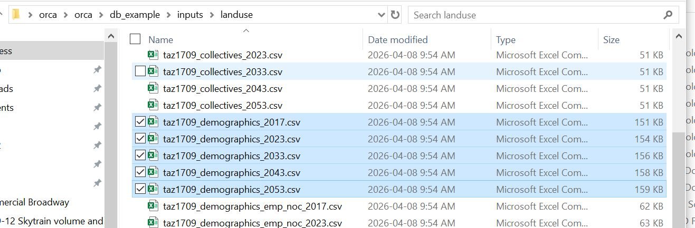
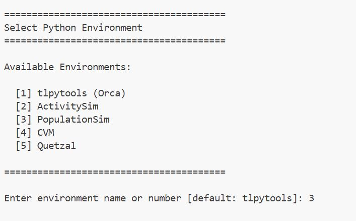

::: {.callout-note appearance="simple"}
A **helper guide** — reference material for working with the PopulationSim
component, not part of the linear Setup → Run walkthrough. Dip in as needed.
:::

## Overview

**PopulationSim** generates the synthetic population that downstream demand
models (ActivitySim) consume. It is one of the five ORCA components and runs
in its own isolated Python environment.

## Where it fits in ORCA

| Aspect | Value |
|---|---|
| Python environment | `populationsim` — Python 3.10, managed by `uv` (`.py_envs\populationsim`) |
| Scenario folder | `<scenario>/popsim/` — configs + input data |
| Config block | `sub_components.populationsim` in `<scenario>/orca_model_config.yaml` |

Because PopulationSim feeds ActivitySim, it typically runs **early** (often
only on the first iteration). Whether it executes is controlled by its
`iterations:` key in the scenario config — see [Running the Model](../chapters/02-run-model.qmd)
for the `all` / `first` / `last` / `[1,3]` semantics shared by all components.

## Running just PopulationSim

To iterate on population synthesis without running the full model, trim
`model_steps` in `<scenario>/orca_model_config.yaml` to the population step
only, then run as usual:

```bat
python -m tlpytools.orca --action run_model --scenario db_example --mode local_testing
```

::: {.callout-warning}
Edit the **scenario** config (`<scenario>/orca_model_config.yaml`), never the
template (`src/orca/orca_model_config_default.yaml`). The template only
applies the next time you `init_model` a fresh scenario.
:::

## Inputs and outputs

- **Inputs** live under `<scenario>/popsim/` (controls, seed tables, geographic
  crosswalks).
- **Outputs** land in the component's output directory and are picked up by
  ActivitySim as its base population.

## Troubleshooting

| Symptom | Likely cause | Fix |
|---|---|---|
| `ImportError` when the popsim step runs | Wrong/!built environment | Re-run `run_python_cmds.bat`; confirm `.py_envs\populationsim` built |
| Step skipped unexpectedly | `iterations:` excludes the current iteration | Check `sub_components.populationsim.iterations` in the scenario config |


## Examples
### Age Cohort Analysis

Study Target: Restrucutre the Population Struture (age distributuion) in synthetic population and simulate the mode share shift

1. Change the Landuse file.
The input file for PopulationSim is the landuse file, which contains the number of households and population by TAZ. By changing the landuse file, we can change the population structure. For example, in this case, we keeps the control total same but shift the age distribution by changing the population structure in the landuse file. We can increase the number of households and population in the TAZs with more **Older people** and decrease the number of households and population in the TAZs with more **Younger people**.

Landuse file saved in `<databank>/inputs/landuse/taz1709_demographic_<horizon>.csv`




2. Run PopulationSim with the new landuse file.
After changing the landuse file, we can run PopulationSim to generate the synthetic population with the new age distribution. To run the PopulationSim, we can use the following steps:
step 1: Activate the PopulationSim environment:
in cmd line, navigate to the ORCA root directory and run the following command:
```bat
run_python_cmds.bat
```
It will let you chose the enviroment from a list, select `PopulationSim` and hit enter. It will activate the PopulationSim environment.



step 2: Run the PopulationSim with the new landuse file:
Navigate to the `<databank>/popsim/` directory, and run the following command:
```bat
python run_synpop.py --mode synpop_update --base-year 2023 --seed-year 2023 --seed-data previous_synpop
```
- `--mode synpop_update` tells the script to update the synthetic population based on the new landuse file.
- `--base-year 2023` specifies the base year for the population synthesis.
- `--seed-year 2023` specifies the seed year for the population synthesis.
- `--seed-data previous_synpop` specifies the seed data to use for the population synthesis. In this case, we are using the previous synthetic population as the seed data.
After running the above command, PopulationSim will generate a new synthetic population with the updated age distribution based on the new landuse file.

3. Run ORCA with the new synthetic population.
After generating the new synthetic population with PopulationSim, we can run the full ORCA model to simulate the mode share shift based on the new population structure.
The new synthetic population file generated in `<databank>/popsim/` will be used as input for the ORCA model.

4. Analyze the results.
After running the ORCA model with the new synthetic population, we can analyze the results. The results are saved in several parquet files.
trips file: `<databank>/activitysim/outputs/final_trip.parquet`
persons file: `<databank>/activitysim/outputs/final_person.parquet`
households file: `<databank>/activitysim/outputs/final_household.parquet`

For network analysis, results saved in:
`<databank>/quetzal/scenarios/<scenario_name>/<peak_period>/`

::: {.callout-tip}
**To expand:** add component-specific input-prep steps, control-table
expectations, and validation/QA checks once the team's PopulationSim
conventions are settled.
:::
